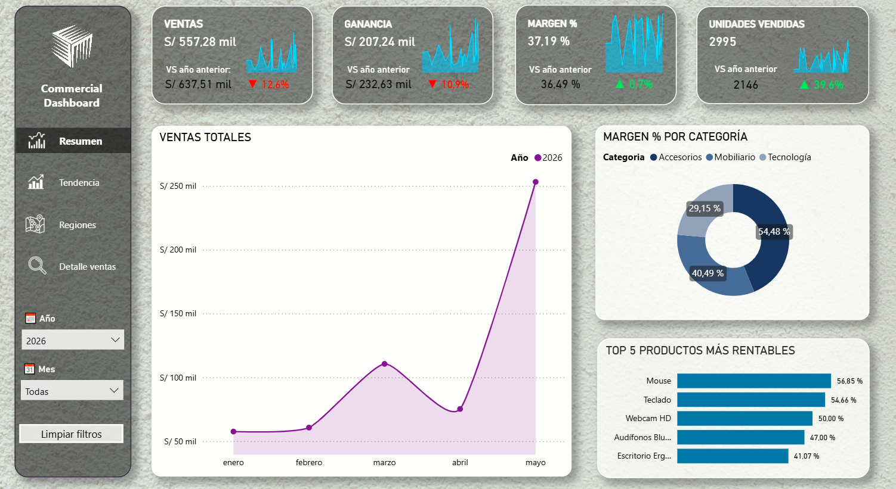
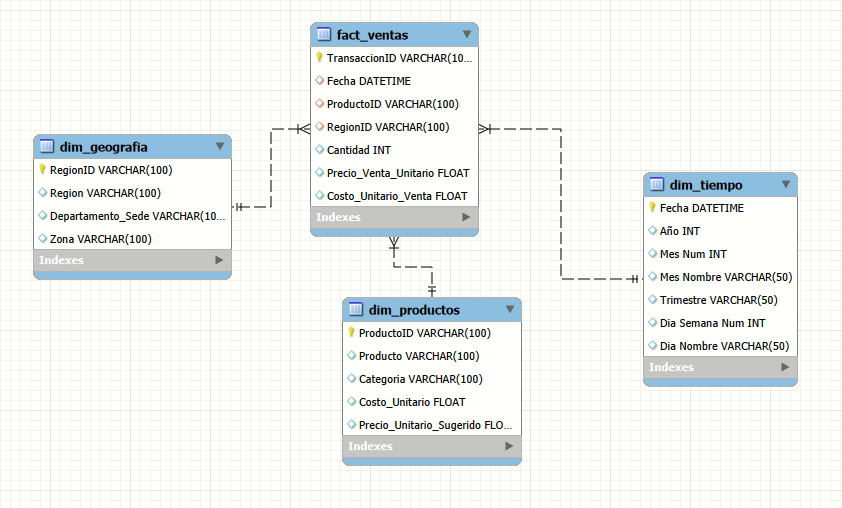

# 📊 Análisis de Ventas Comerciales

Proyecto de análisis de ventas end-to-end: modelado de datos con **MySQL**, consultas SQL para exploración y validación, y un **dashboard interactivo en Power BI** para el seguimiento de KPIs comerciales.

## 🖥️ Dashboard Interactivo

Haz clic en la imagen para explorar el dashboard en tiempo real:

## 🎯 Objetivo del proyecto

Analizar el desempeño comercial de una empresa (ventas, ganancia, margen y 
comportamiento por región/producto) partiendo de datos transaccionales crudos, 
pasando por un modelo relacional en SQL hasta un dashboard interactivo que 
permite explorar tendencias y tomar decisiones.

## 🗂️ Modelo de datos

El proyecto sigue un esquema en estrella (star schema):

- **fact_ventas**: tabla de hechos con las transacciones (cantidad, precio, costo)
- **dim_productos**: catálogo de productos y categorías
- **dim_geografia**: regiones y zonas de venta
- **dim_tiempo**: dimensión de calendario

